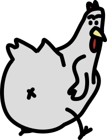

<h1 align="center">
    <br>
<a href="http://www.youtube.com/watch?feature=player_embedded&v=SG8In6-1OQA"
target="_blank"></a>
    <br>
    Bessy Adventure
    <br>
</h1>

<h4 align="center">A simple text RPG written in <a href="https://www.open-std.org/JTC1/SC22/WG14/www/standards" target="_blank">Prolog</a>.</h4>

<p align="center">
<a href="./LICENSE"></a>
<a href="https://www.buymeacoffee.com/gabrielzschmitz" target="_blank"></a>
<a href="https://github.com/gabrielzschmitz/BessyAdventure"></a>
</p>

<p align="center">
  <a href="#-how-to-use">How to Use</a> •
  <a href="#-software-used">Software Used</a> •
  <a href="#-dependencies">Dependencies</a> •
  <a href="#-thanks-to">Thanks to</a> •
  <a href="#-demo-video">Demo Video</a> •
  <a href="#-license">License</a>
</p>

## 🚀 How to Use

First consult the prolog. After that use the `rodar` command.
```
?- rodar. 
```

Now you are playing the game. Use the following commands to act.
```
|: pegar(x). 
|: ir_para(x). 
```
Use `pegar(x)` to get `x` to your invertory and `ir_para(x)` to go to `x`.

## 🎨 Software Used
The following programs were used to produce this game and animation:

 * <i>[<b>SWI-Prolog</b>](https://www.swi-prolog.org/):</i> as prolog interpreter;
 * <i>[<b>Krita</b>](https://krita.org/en/):</i> as animation software;
 * <i>[<b>Inkscape</b>](https://inkscape.org/):</i> as vectorial based painting software;
 * <i>[<b>Kdenlive</b>](https://kdenlive.org/en/):</i> as video editor.

All the <b>assets, projects and scripts</b> can be found at the <b>[repository](./vid/)</b>.

## ⚓ Dependencies
 The only dependencie is a <b>prolog interpreter</b>. A good one is the [<b>SWI-Prolog</b>](https://www.swi-prolog.org/). 

## 🙌 Thanks to
- [<b>VTn</b>](https://github.com/VTnPog) - By helping me to create the opening.

## 📼 Demo Video
<b>Game demo with visuals</b> for better imagination.

<p align="center">
<a href="http://www.youtube.com/watch?feature=player_embedded&v=kqqqur_gqJA"
target="_blank"></a>
</p>

## 📜 License
This software is licensed under the [GPL-3](./LICENSE) license;

All rights reserved to [Adult Swim](https://www.youtube.com/@adultswim) for [Rick and Two Crows - Main Title Song](https://www.youtube.com/watch?v=LZSsgJF_U2E) used in the project.

